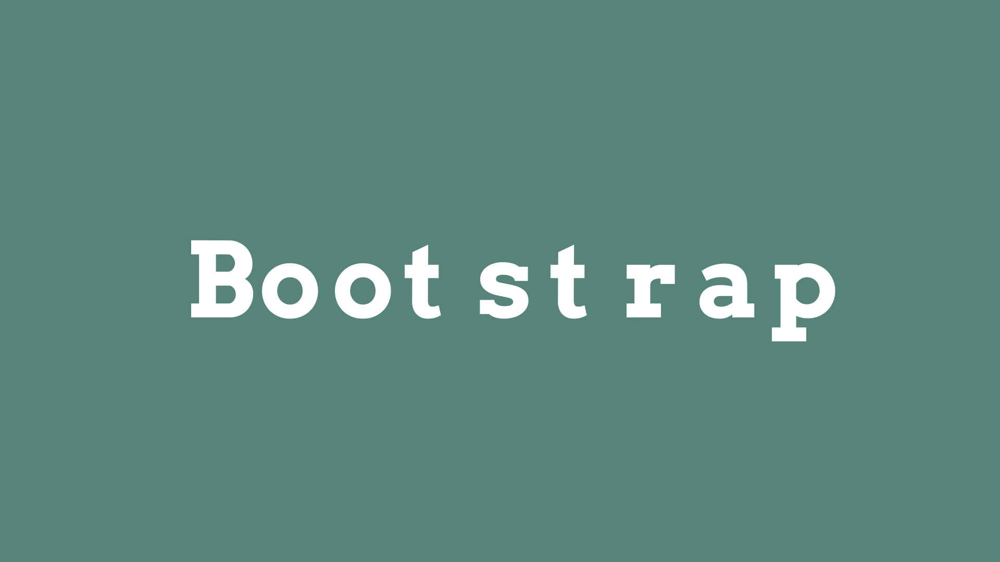

# Logo Generator (GoLang)

A Golang CLI app to generate random logos from a CSV file. The app utilizes parallel processing and goroutines to create more than one variation.

## Features

* Reads a CSV file for logo names
* Uses random font.
* Uses random background color.
* Saves the file as PNG

## Usage

1. Git clone this repo.
2. Execute the following commands:

```
go get github.com/golang/freetype
go run logomaker.go
```

## Test Results

| Number of Companies | Number of Variations for each | Total Logos | Max Number of Process | Concurrency | Execution Time |
|---------------------|-------------------------------|-------------|-----------------------|-------------|----------------|
|          5          |              100              |     500     |           5           |      On     |  12.30 seconds |
|          5          |              100              |     500     |           2           |      On     |  16.48 seconds |
|          5          |              100              |     500     |           -           |     Off     |  29.73 seconds |

## Sample Output




## Todo

* Add more fonts.
* Add support for shapes and icons.
* Save the files as SVG.